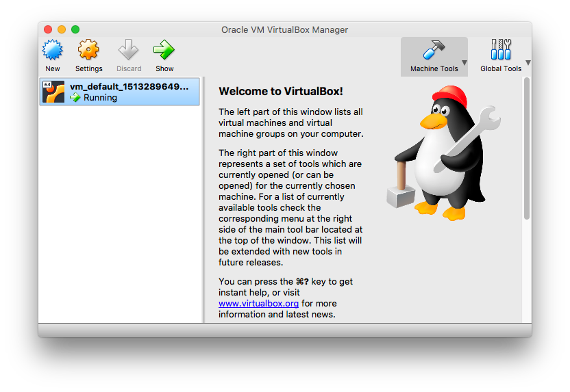

Setup a VM using [vagrant](https://www.vagrantup.com/) that matches the Travis
CI build environment.

# Dependencies

[packer](https://www.packer.io/intro/getting-started/install.html)
## macOS
```
$ brew install virtualbox vagrant
```

# Creating the VM
When starting from scratch, this downloads an Ubuntu 14.04 Trusty image, runs
the provision script (which should match ../.travis.yml), and then runs the
tests. This will take awhile.
```
$ vagrant up
```

If everything has run correctly, you should see an output like:
```
...
    default: cat build/test_summary.txt
    default: TEST SUMMARY BEGIN 22:25:05
    default: Core tests
    default:   22:25:28 TEST RESULT pointwise PASSED
    default:   22:25:52 TEST RESULT conv_1_2 PASSED
    default:   22:26:16 TEST RESULT conv_2_1 PASSED
    default:   22:26:44 TEST RESULT conv_3_1 PASSED
    default:   22:27:58 TEST RESULT conv_bw PASSED
    default: 
    default: Serpent tests
    default:   22:28:39 TEST RESULT pointwise PASSED
    default:   22:28:54 TEST RESULT conv_1_2 PASSED
    default:   22:29:09 TEST RESULT conv_2_1 PASSED
    default:   22:29:23 TEST RESULT conv_3_1 PASSED
    default: make[1]: Leaving directory `/home/vagrant/CGRAFlow'<Paste>
```

Open virtualbox and make sure you see a running virtual machine, something like:



Shut down the machine via the CLI using
```
$ vagrant halt
```

The virtualbox window should now say 'Powered Off'.

*Optional*: Right click on the VM and choose 'Clone' to rename the VM (e.g.
'cgraflow')

To export the appliance, use File > Export Appliance, select the new VM and
follow the instructions.

(12-14-17) - Lenny used Open Virtualization Format 1.0
